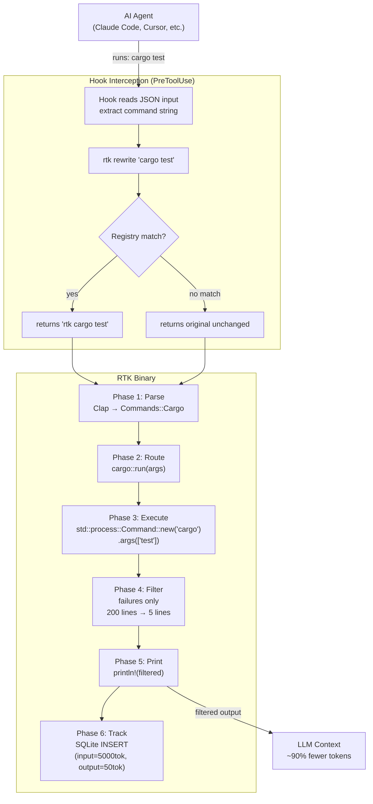
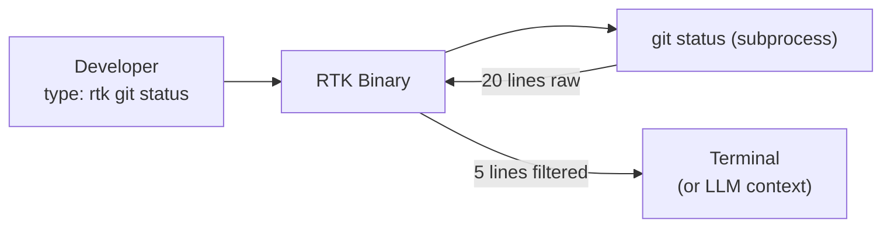
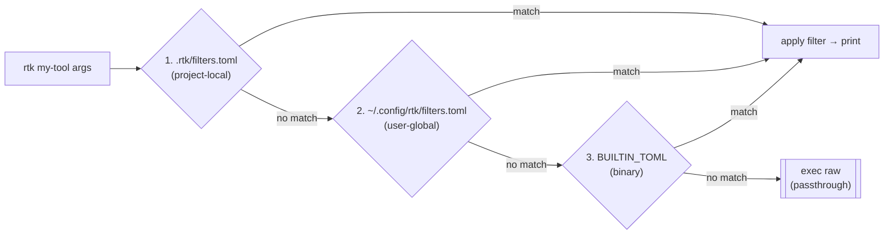

# Command Flow

End-to-end flow from the AI agent issuing a command to the filtered output reaching the LLM.

## With hook (transparent rewrite)

## Without hook (direct usage)

## Filter lookup (TOML path)

