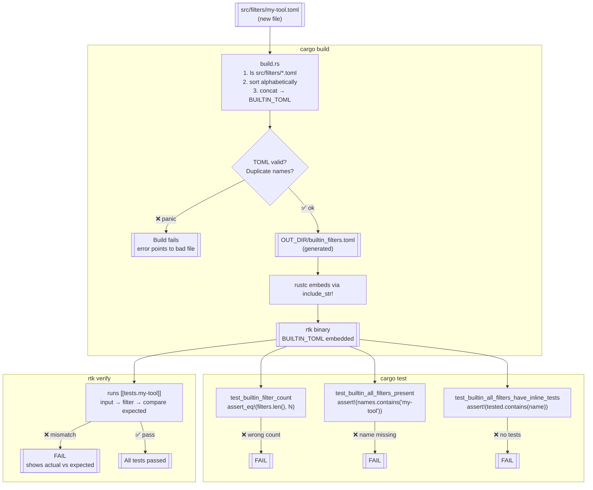
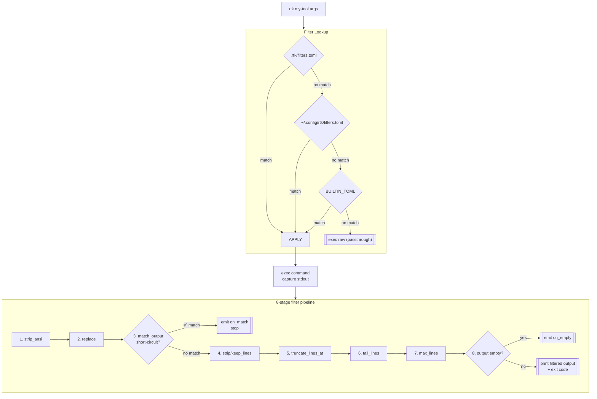

# Filter Pipeline

## Build pipeline

```mermaid
flowchart TD
    A[["src/filters/my-tool.toml\n(new file)"]] --> B

    subgraph BUILD ["cargo build"]
        B["build.rs\n1. ls src/filters/*.toml\n2. sort alphabetically\n3. concat → BUILTIN_TOML"] --> C
        C{"TOML valid?\nDuplicate names?"} -->|"❌ panic"| D[["Build fails\nerror points to bad file"]]
        C -->|"✅ ok"| E[["OUT_DIR/builtin_filters.toml\n(generated)"]]
        E --> F["rustc embeds via include_str!"]
        F --> G[["rtk binary\nBUILTIN_TOML embedded"]]
    end

    subgraph TESTS ["cargo test"]
        H["test_builtin_filter_count\nassert_eq!(filters.len(), N)"] -->|"❌ wrong count"| I[["FAIL"]]
        J["test_builtin_all_filters_present\nassert!(names.contains('my-tool'))"] -->|"❌ name missing"| K[["FAIL"]]
        L["test_builtin_all_filters_have_inline_tests\nassert!(tested.contains(name))"] -->|"❌ no tests"| M[["FAIL"]]
    end

    subgraph VERIFY ["rtk verify"]
        N["runs [[tests.my-tool]]\ninput → filter → compare expected"]
        N -->|"❌ mismatch"| O[["FAIL\nshows actual vs expected"]]
        N -->|"✅ pass"| P[["All tests passed"]]
    end

    G --> H & J & L & N
```

## Runtime stages

```mermaid
flowchart TD
    CMD["rtk my-tool args"] --> LOOKUP

    subgraph LOOKUP ["Filter Lookup"]
        L1{".rtk/filters.toml"} -->|"match"| APPLY
        L1 -->|"no match"| L2
        L2{"~/.config/rtk/filters.toml"} -->|"match"| APPLY
        L2 -->|"no match"| L3
        L3{"BUILTIN_TOML"} -->|"match"| APPLY
        L3 -->|"no match"| RAW[["exec raw (passthrough)"]]
    end

    APPLY --> EXEC["exec command\ncapture stdout"]
    EXEC --> PIPE

    subgraph PIPE ["8-stage filter pipeline"]
        S1["1. strip_ansi"] --> S2
        S2["2. replace"] --> S3
        S3{"3. match_output\nshort-circuit?"}
        S3 -->|"✅ match"| MSG[["emit on_match\nstop"]]
        S3 -->|"no match"| S4
        S4["4. strip/keep_lines"] --> S5
        S5["5. truncate_lines_at"] --> S6
        S6["6. tail_lines"] --> S7
        S7["7. max_lines"] --> S8
        S8{"8. output empty?"}
        S8 -->|"yes"| EMPTY[["emit on_empty"]]
        S8 -->|"no"| OUT[["print filtered output\n+ exit code"]]
    end
```
